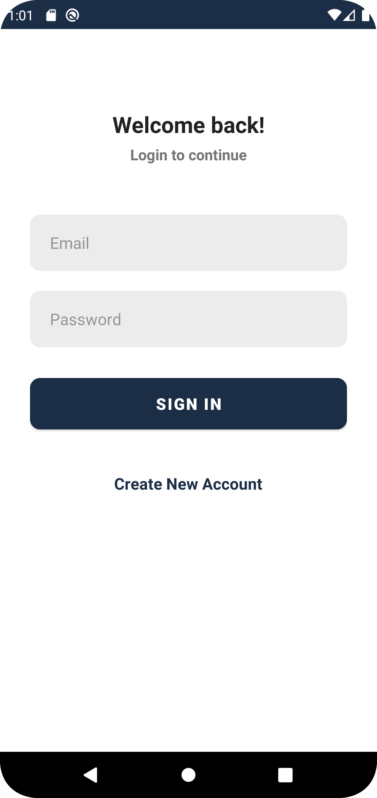
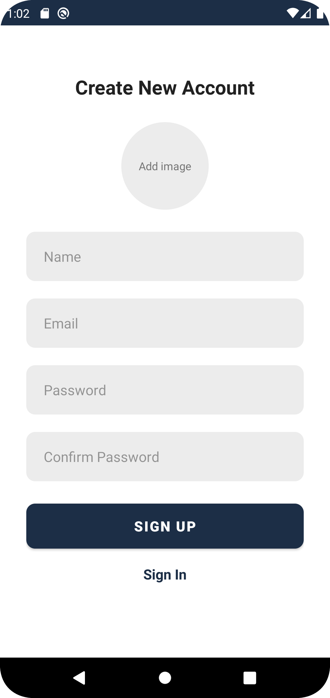
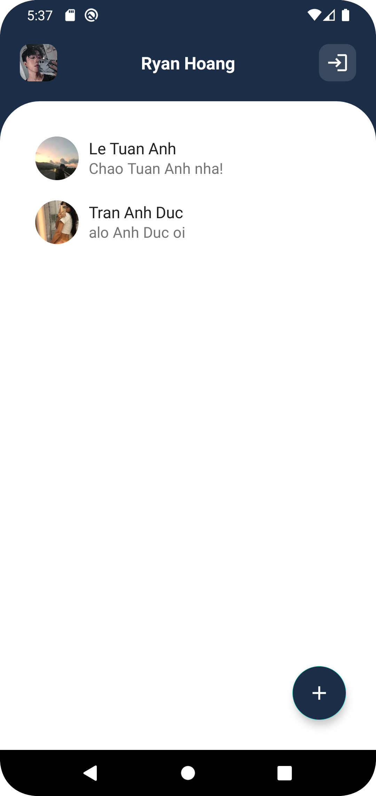
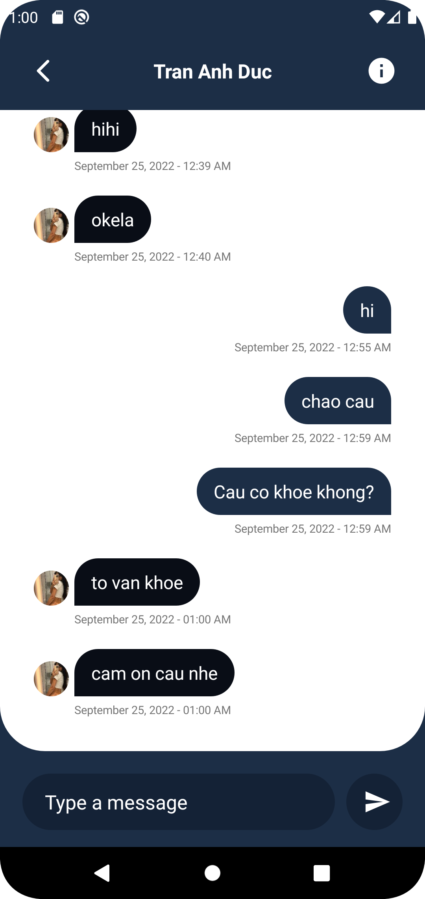

# android-chat-app

<pre>
            
</pre>

##

 
 

 
# Firebase implementation:

    
    implementation 'com.google.firebase:firebase-messaging:23.0.5'
    implementation 'com.google.firebase:firebase-firestore:21.4.0'
 
 # Another implementation:
 
    // Scalable Size Uni (support for different screen sizes)
    implementation 'com.intuit.sdp:sdp-android:1.0.6'  //SDP - a scalable size unit for screen
    implementation 'com.intuit.ssp:ssp-android:1.0.6' //SSP - a scalable size unit for text

    // Rounded ImageView
    implementation 'com.makeramen:roundedimageview:2.3.0'

    // MultiDex
    implementation 'androidx.multidex:multidex:2.0.1'
 

# 💫About Me :

I'm a android developer from Vietnam.

- 🔭 I’m currently studying at [Vietnam Academy of Cryptography Techniques](https://actvn.edu.vn/)

- 🌱 I’m currently learning **Android(Java)**

- 💬 Ask me about **android, mobile,..**

- 📫 How to reach me **huuthom0209@gmail.com**

# 🌐Socials
    

### ✍️Random Dev Quote

---

